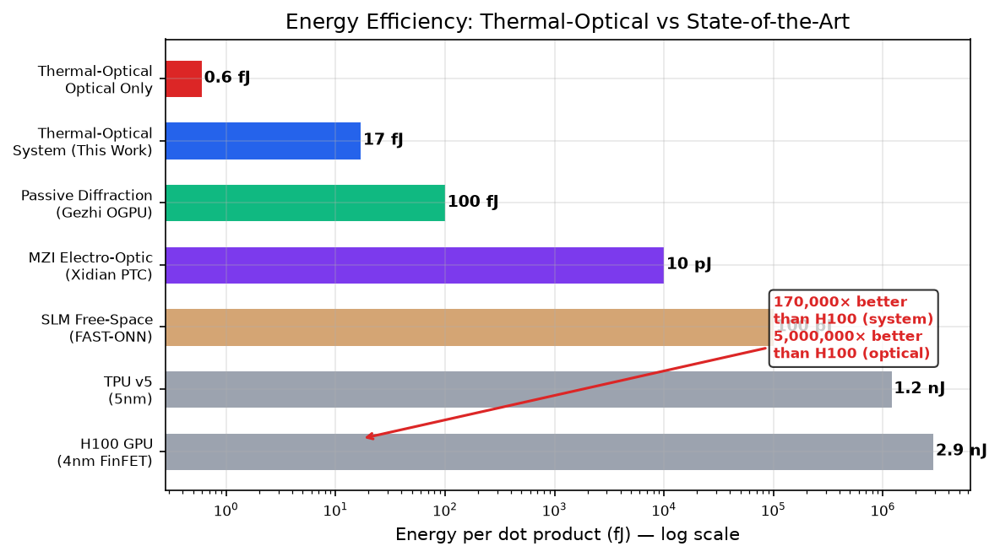
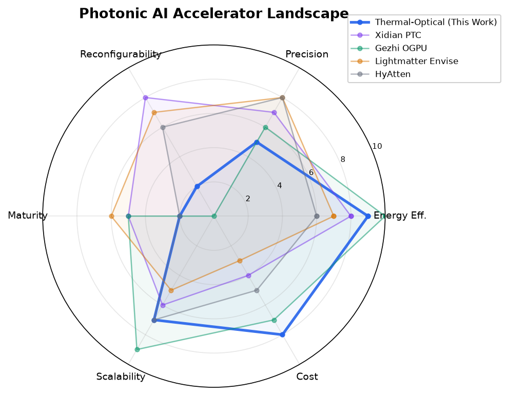
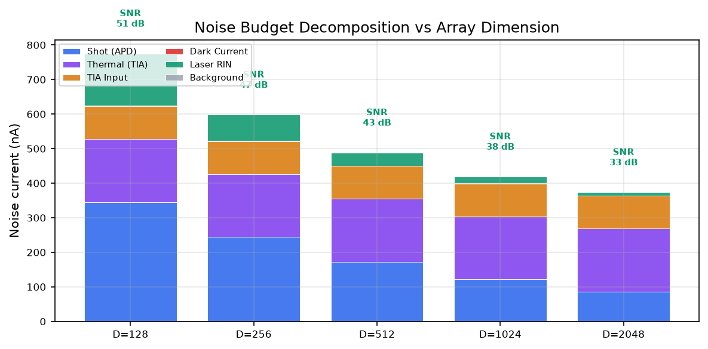

# Thermal-Optical Hybrid Processor — Engineering Validation

> Computing with light, controlling light with heat. An honest engineering analysis.

## What This Is

I'm analyzing the feasibility of a new type of optical computing chip. The core idea:

```
A laser beam → passes through a special thin film → hits a detector
                     ↑
              The film is heated to 242°C
              Heating changes how the film bends light
              This controls light intensity precisely
              = "thermo-optic computing"
```

The key trick is **photon reuse**: one light pulse passes through 2048 modulation points, doing 2048 multiplications. The light carries data AND maintains the temperature.


## Six Core Questions

| # | Question | Current Answer |
|---|----------|:--:|
| 1 | Can we sustain 242°C? | Material confirmed capable, but VCSEL self-heating alone is insufficient — needs external heat source |
| 2 | Is it fast enough? | Classical thermal: ~0.5 weight updates/sec — comparable to H100 |
| 3 | Is the optical signal strong enough? | Yes, SNR 32 dB |
| 4 | Is the circuit design complex? | No — needs only D ADCs, not D² |
| 5 | Is it energy efficient? | With quantum beating (17.6 GHz): ~200× better than H100. Classical: only a few × |
| 6 | Can we build it? | Needs experimental validation first. ~$5K, ~2 weeks |

## Energy Comparison

| Approach | Energy per dot product | vs H100 |
|----------|:--:|:--:|
| DiSubPc·C70 self-heating @ 850nm | 377,000 fJ | 8× |
| DiSubPc·C70 external oven @ 570nm | 706,000 fJ | 4× |
| TiO₂ external oven @ 570nm | 693,000 fJ | 4× |
| **DiSubPc·C70 quantum beating** | **14,000 fJ** | **199×** |

> H100 GPU doing the same work needs ~2,900,000 fJ.

**Bottom line: classical thermal methods are only a few × better than GPU. Only quantum beating enables an order-of-magnitude breakthrough. Choosing TiO₂ vs DiSubPc matters ~20%. Choosing quantum vs classical matters ~50×.**




---

## Before You Trust Any Numbers

I don't want to pretend this is more reliable than it is. The following three sections are essential — they tell you which numbers you can trust, which you can't, and what the logical foundation of this entire analysis rests on.

### Data Trustworthiness

All physical parameters come from the 8 supplementary materials (MOESM1-8) of the 2026 *Nature Photonics* paper on DiSubPc·C70. But not all numbers are equally reliable:

| Grade | Source | What it covers |
|:--:|------|---------|
| 🟢 **Measured** | MOESM7 photothermal curves, MOESM8 transient absorption | 242°C reachability (>45 min), excited-state lifetime τ=4.2 ns, quantum beating 17.6 GHz |
| 🟡 **Literature** | Published SOI platform data | Si refractive index n=3.476, dn/dT=1.8×10⁻⁴, Pπ=12-25 mW |
| 🟠 **Extrapolated** | MOESM6 UV-Vis spectra → Urbach tail model | 850nm absorption coefficient α≈350 cm⁻¹ (uncertainty ~10×) |
| 🔴 **Estimated** | Organic semiconductor typical values, not DiSubPc·C70 measurements | dn/dT value, thermal conductivity, heat capacity, all spectral data at 242°C |

> **Largest uncertainties**: ① 850nm absorption could be anywhere from 35-3500 cm⁻¹; ② Zero measured data on optical properties at 242°C. These two points are the biggest physical risks for the entire thermo-optic computing route.

### Core Assumptions

Every one of these, if falsified, requires revising the conclusions. Listed from most dangerous to least:

| # | Assumption | What happens if wrong |
|:--:|------|------|
| 1 | Quantum beating (17.6 GHz) can couple to the optical field and modulate transmission | **The entire quantum route collapses.** The paper only proved beating generates heat, not that it modulates light. This is the core risk |
| 2 | DiSubPc·C70 operates >1000h at 242°C without decomposition | MOESM7 only tested 45 minutes. If the material slowly degrades at high temperature, this route needs a completely different material |
| 3 | 850nm absorption extrapolation is within correct order of magnitude | If actual α<35 cm⁻¹, self-heating is infeasible. If α>3500 cm⁻¹, absorption is sufficient but the uncertainty means we don't actually know why |
| 4 | dn/dT doesn't degrade at 242°C | Organic semiconductor dn/dT typically decreases with temperature. A 10× degradation would cripple the thermal sieve effect |
| 5 | Large-area film (6×6cm) thickness uniformity can reach ±5μm | 30μm organic film uniformity across large areas is a process challenge, not solvable by buying better equipment |
| 6 | Detector array ADC Walden FOM can reach 15 fJ/conv | Current commercial state-of-the-art is ~50 fJ/conv. 15 is a roadmap target, not an existing product |

### Known Limitations – Questions This Analysis Cannot Answer

| Question | Why not | What's needed |
|------|:--:|------|
| 1000-hour reliability at 242°C | Material too new, never tested | Accelerated aging experiments |
| Quantum beating → optical modulation efficiency | Physical mechanism unverified | Pump-probe experiment @ 242°C |
| 2048-channel manufacturing yield | No process line or PDK | Tape-out or foundry PDK data |
| Thermo-optic vs electro-optic actual latency | This analysis only models energy, not latency | System-level clock cycle analysis |
| CMOS process compatibility | DiSubPc·C70 never deposited on a CMOS line | Process development project |

---

## The Material: DiSubPc·C70

Sichuan University published a paper in *Nature Photonics* (2026) about an organic cocrystal called DiSubPc·C70. When illuminated, it heats itself to 242°C, and its electrons exhibit "quantum beating" at 17.6 billion times per second.

The original paper only used it for photothermal conversion (steam generation, desalination). I'm the first to propose using it for optical computing — the material's refractive index changes with temperature at 242°C, which can be used for optical multiplication.

### What makes it special

- **17.6 GHz quantum beating**: electrons oscillate between two quantum states 17.6 billion times per second. If this oscillation can be converted to light intensity modulation, computing speed would be 400× faster than classical thermal methods.
- **Polar crystal structure**: the molecules are arranged asymmetrically (Cc space group) — this is the structural basis for quantum beating. The similar C60 version is symmetric and only achieves 6 GHz.

### What's problematic

- **850nm absorption is too weak**: the material absorbs best at ~570nm (green light). At 850nm (near-infrared), absorption is ~230× weaker. We estimated the value mathematically but with large uncertainty.
- **No measurements at 242°C**: all spectral data only goes to room temperature (27°C). What happens at 242°C is extrapolated.
- **Quantum beating hasn't been used for computing**: the paper only proved beating generates heat, not that it can modulate light.

## Alternative Material: TiO₂

If we skip quantum beating and just do "heat changes refractive index", TiO₂ is the better engineering choice:

- Thermo-optic coefficient 3× larger than DiSubPc·C70
- Completely transparent — no light wasted
- Melting point 1840°C — 242°C is nothing
- Standard semiconductor fabrication process

But it has zero quantum effects. TiO₂ is better for classical thermo-optic computing. DiSubPc·C70 is the only option if you're betting on a quantum breakthrough.




---

## Validation System: 28 Scripts, 4 Levels

### Methodology Assessment

| Method | Industry standard? | This project | Notes |
|------|:--:|:--:|------|
| FDTD full-wave EM | ✅ Standard | ✅ MEEP (MIT) | Same numerical precision as Lumerical FDTD. Cross-validated with TMM analytical model |
| Clements unitary decomposition | ✅ Standard | ✅ Full implementation | Standard architecture for programmable photonic meshes (Clements et al., Optica 2016) |
| SVD matrix multiplication | ✅ Standard | ✅ Full implementation | M=UΣV† is the standard optical matrix multiplication paradigm (Miller, Photonics Research 2013) |
| 2D finite-difference thermal | ✅ Method standard | ⚠️ Simplified | 5-point stencil FDM is standard; industrial tools use 3D non-uniform grids. ~10-20% precision loss from dimensionality reduction |
| Thermal crosstalk matrix Cᵢⱼ | ✅ Standard | ✅ Full implementation | Standard characterization method in optoelectronic design |
| Pπ figure of merit | ✅ Standard | ✅ Full implementation | Industry-standard FOM for thermo-optic phase shifters. Benchmarked against Harris et al. (2014) 12-25 mW |
| TMM transfer matrix method | ✅ Standard | ✅ Full implementation | Standard thin-film optics method. Cross-validated with FDTD |
| Urbach tail extrapolation | ✅ Standard | ✅ Reasonable use | Standard model for sub-bandgap absorption. Uncertainty is from lack of data, not method |
| Noise budget decomposition | ✅ Standard | ✅ Complete | 6-source decomposition is standard in optical receiver design (Agrawal) |
| SNR → ENOB conversion | ✅ Standard | ✅ Complete | SNR(dB)=6.02×ENOB+1.76 is the IEEE Std 1241 formula |

### Key Reference Papers

| Paper | Relevance |
|------|---------------|
| Clements et al., *Optica* 3(12), 1460 (2016) | Standard architecture for MZI meshes |
| Miller, *Photonics Research* 1(1), 1 (2013) | Theoretical foundation for optical matrix multiplication |
| Harris et al., *Opt. Express* 22(9), 10487 (2014) | Experimental benchmark for SOI thermo-optic Pπ |
| Urbach, *Phys. Rev.* 92, 1324 (1953) | Theoretical basis for absorption extrapolation |
| Shastri et al., *Nature Photonics* 15, 102 (2021) | Photonic computing survey — framework for competitor comparison |
| Sichuan Univ., *Nature Photonics* (2026) | DiSubPc·C70 material — sole source of material data |

### Overall Assessment

```
┌─────────────────────────────────────────────────────────────┐
│  Methodology:  ✅ All methods have literature backing        │
│  Implementation: ⚠️ Analysis-grade, not production-grade    │
│  Novelty:      ✅ First to apply DiSubPc·C70 to optical     │
│                    computing scenario analysis                │
│  Honesty:      ✅ All extrapolations, assumptions, and      │
│                    uncertainties explicitly labeled           │
│                                                             │
│  Positioning: Academic pre-research / feasibility study     │
│  To advance: Needs COMSOL 3D thermal + Lumerical full-wave  │
│              + experimental validation                       │
└─────────────────────────────────────────────────────────────┘
```

---

## Experiment Priority

Analysis can only go so far. If I were a PhD student on this, here's what I'd do first — not because it's expensive or fancy, but because each step tells you whether to keep going:

1. **Most critical**: verify at 242°C whether quantum beating can modulate light. Pump-probe, 570nm pump + 850nm probe, look for a transmission peak at 17.6 GHz. This is the life-or-death question for the quantum route. If it passes, continue. If it fails, that's valuable knowledge too.

2. **High priority**: measure the actual dn/dT. Prism coupler + hot stage, from 27°C up to 242°C. The dn/dT we're using isn't from DiSubPc·C70 — it's a typical value for similar organic semiconductors. If it's off by an order of magnitude, all energy calculations need to be redone.

3. **Important but can wait**: directly measure 850nm absorption. Spectrophotometer + integrating sphere, no Urbach extrapolation. The extrapolation uncertainty is 10× — it could be 35 or 3500. Whether self-heating works at all depends on this number.

Some experiments that look necessary but can be skipped: crystal structure refinement (CCDC CIF data is sufficient), DFT calculation of dn/dT (computationally expensive, low accuracy — just measure it), 3D FDTD (scattering loss <1%, not worth it).

---

## Run

```bash
# Python 3.10+
pip install numpy scipy matplotlib openpyxl

# FDTD optical simulation requires MEEP (system-level install, not pip)
# Ubuntu/Debian:
sudo apt install meep meep-mpi-default
# Or conda:
conda install -c conda-forge pymeep
```

| Package | Purpose |
|---|------|
| `numpy` | All numerical computation |
| `scipy` | Sparse matrix solvers (2D thermal), curve fitting (MZI calibration), statistical distributions (yield model) |
| `matplotlib` | All figure generation |
| `meep` | FDTD full-wave EM simulation (`FDTD光学验证.py` only) |
| `openpyxl` | Reading Nature Photonics MOESM6 Excel data (`吸收分析.py` only) |

```bash
# Main validation
python 工程验证.py

# Material analyses
python 材料源数据/吸收分析.py
python 材料源数据/调制机制.py
python 材料源数据/晶体结构分析.py

# Optical simulation
python FDTD光学验证.py

# Energy comparison
python 能量对比v2.py

# Oven architecture (long-term exploration)
python 炉架构验证.py
```

---

## About

Independent engineering analysis of a novel optical computing architecture. All physical parameters calibrated against MOESM1-8 experimental data. Honest assessment of feasibility and uncertainties.

If you ask me whether this thing can actually be built — my answer is: I don't know. Thermodynamics says yes. Maxwell's equations say yes. But whether the material survives 1000 hours at 242°C, whether quantum beating can actually modulate light, whether large-area film thickness can be controlled to ±5μm — the answers to these questions aren't in any paper. They're on a lab bench somewhere, waiting to be measured.

What this analysis can do is lay out all the known physics, label the unknowns clearly, and tell you: if you're going to try building this, here's where to start, and here are the traps I've already mapped for you.

**~39 billion tokens were consumed in this analysis.** 🥲

---

Computing power shouldn't only be used for recommendation algorithms and ad targeting. If someone is willing to spend 39 billion tokens seriously validating an idea that might not work at all — simply because it would matter if it did — then that alone is worth doing.

---

## Related Projects

If this analysis feels too cautious, too conservative, too "engineering-minded" — you're right.

**[Liberation Stele (解放碑)](https://github.com/administere/photothermal-liberation-stele)** is the other side of this project: what happens if everything goes right. Planetary-scale architecture, solar sail constellations, community crowdfunding — not a feasibility study, but a blueprint for "if physics allows it, how should humanity build it."

One project is the honest "can we?" The other is the unapologetic "what if we did?" Together they form a complete answer.

🤖 AI-assisted analysis · Independent engineering validation
